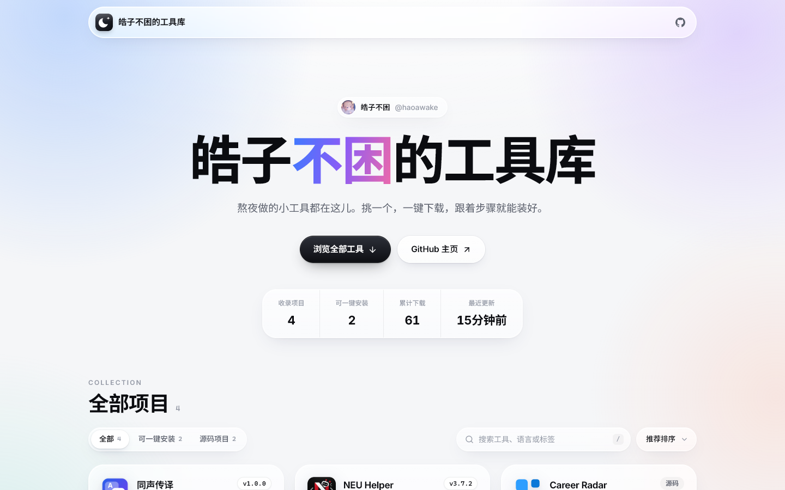

<p align="center"></p>

<h1 align="center">皓子不困的工具库</h1>

<p align="center">
  熬夜做的小工具都在这儿。挑一个，一键下载，跟着步骤就能装好。<br>
  <a href="https://haoawake.github.io/toolbox/"><b>👉 打开工具库</b></a>
</p>



## 它做了什么

- **自动收录**：我在 GitHub 上的所有公开仓库都会自动出现在这里（工具库自己除外），不用手动维护列表。
- **每天自动更新**：每天自动抓一次所有项目的最新 Release，不用手动维护；访客打开网页直接看到最新一次更新的结果。
- **一键下载**：自动识别访客的系统（Windows / macOS / Linux）和芯片（x64 / Apple 芯片），直接给出最合适的安装包。
- **傻瓜式安装指南**：下载后自动切到安装步骤，每一步写清楚点哪里；常见问题（SmartScreen 拦截、macOS「已损坏」等）也有现成解法。
- **像应用商店一样的详情页**：截图预览、README 介绍（优先显示中文版 `README.zh-CN.md`）、版本历史、SHA-256 校验值。
- 洁白的液态玻璃风格界面，手机上也能正常浏览。

## 让新项目在工具库里显示得更好

新项目只要是**公开仓库**就会自动出现。想让它更好看、更好装：

| 想要的效果 | 怎么做 |
|---|---|
| 有一句话简介 | 填好仓库的 About → Description |
| 能一键下载 | 发布一个 Release，把安装包作为附件上传 |
| 自动认出系统和芯片 | 安装包文件名里带上系统和架构，比如 `App-win-x64.zip`、`App-mac-arm64.dmg`、`App-linux-x86_64.AppImage` |
| 显示应用图标 | 仓库里放一个 `icon.png`（或 `assets/icon.png`、`logo.svg`），会被自动找到 |
| 中文介绍 | 放一个 `README.zh-CN.md`，会优先显示它 |
| 截图预览 | README 里的截图会自动出现在详情页顶部 |
| 标签 | 给仓库加 Topics |

## 配置：`toolbox.config.json`

大部分东西都是自动的，需要手动调的都在这一个文件里：

```jsonc
{
  "owner": "haoawake",                 // GitHub 用户名
  "selfRepo": "haoawake/toolbox",      // 工具库自己，不在列表里显示
  "site": { "title": "皓子不困的工具库", "highlight": "不困", "tagline": "…" },
  "hidden": ["某个不想展示的仓库"],
  "extraRepos": ["别的组织/某个仓库"],   // 把不在自己名下的仓库也加进来
  "mirror": "",                        // 可选：下载加速前缀
  "projects": {
    "neu-helper": {
      "displayName": "NEU Helper",     // 显示名
      "tagline": "…",                  // 覆盖仓库简介
      "icon": "gui/icon-128.png",      // 指定图标（仓库内路径或完整 URL）
      "readme": "docs/README.zh.md",   // 指定展示哪个 README
      "appName": "NEU Helper",         // 安装后的应用名（用在 macOS 的命令里）
      "requirements": ["Windows 10 / 11", "…"],
      "install": {                     // 自定义安装步骤，接在「下载」后面
        "windows": [{ "title": "…", "body": "支持 `行内代码` 和 {asset} 占位符", "code": "要复制的命令", "tip": "小贴士" }],
        "macos": [],
        "source": []                   // 没有 Release 的项目，「获取源码」页的步骤
      },
      "troubleshooting": { "windows": [{ "title": "…", "body": "…" }] }
    }
  }
}
```

改完提交到 `main`，GitHub Actions 会自动重新构建发布。

## 数据是怎么更新的

**GitHub Actions**（`.github/workflows/deploy.yml`）每天运行一次（北京时间凌晨 3 点），每次推送到 `main` 时也会运行：执行 `npm run snapshot` 抓取所有仓库、Release、README 和图标，生成 `public/data/snapshot.json`，然后构建并发布到 GitHub Pages。

网页只读这份数据，不直接调用 GitHub 接口，所以访客再多也不会被限流。

**发了新版本想马上显示？** 打开 [Actions 页面](https://github.com/haoawake/toolbox/actions/workflows/deploy.yml)，点「Run workflow」，一分钟左右就更新好了。

也可以让别的项目发版后自动触发更新：在那个项目的发版流程里加一步（需要一个有 `repo` 权限的 token，存成那个仓库的 secret `TOOLBOX_TOKEN`）：

```yaml
- run: gh api repos/haoawake/toolbox/dispatches -f event_type=refresh
  env:
    GH_TOKEN: ${{ secrets.TOOLBOX_TOKEN }}
```

> 注意：GitHub 会在仓库 60 天没有任何活动后暂停定时任务。到时候 Actions 页面会有提示，点一下重新启用即可。

## 本地开发

需要 Node.js 22 或更新版本。

```bash
npm install
npm run snapshot   # 拉取数据；设置环境变量 GITHUB_TOKEN 可以避开每小时 60 次的接口限额
npm run dev        # http://localhost:5173
npm run build      # 输出到 dist/
```

技术栈：React 19 · TypeScript · Vite，没有后端，部署在 GitHub Pages。
